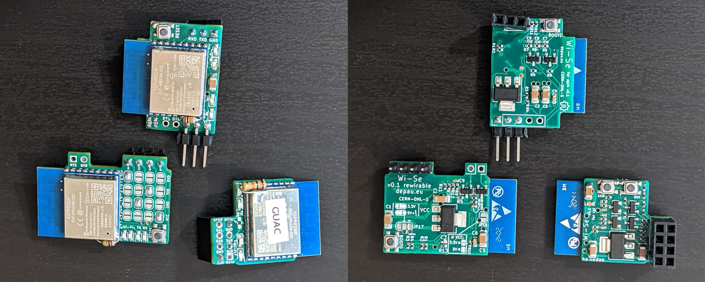
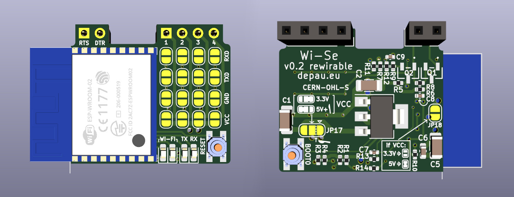
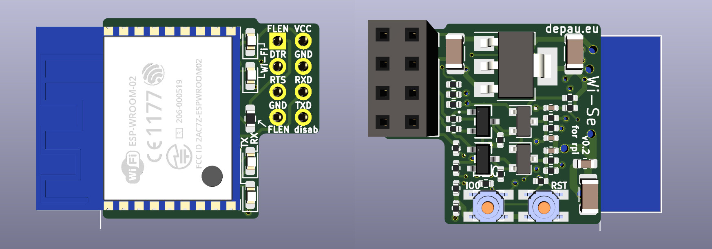

# Wi-Se (Hardware)

Wi-Se is a set of ESP8266-based boards intended to be used with
[Wi-Se (firmware)](https://github.com/Depau/wi-se-sw/).

They are intended to be always connected to a device's UART header in order to
troubleshoot boot issues or crashes without having to take the board out of the
case.

## Variants

### Rewirable

Provides solder jumpers to configure the header output. It can be powered from
5V or 3.3V.

### Raspberry Pi header

Compatible with Raspberry Pi and all boards with a compatible pinout.
Runs on 5V.

### Orange Pi 4 header

Orange Pi boards have a raspi header, however the main UART is usually on 3
separate pins.

This makes connection a little more awkward, since there's no power on the UART
header and they tend to orient it differently in different boards.

In fact, this variant has been designed to fit above the PCB of the Orange Pi 4.
On an Orange Pi Zero it would work, but it would stick out from the side.

It needs a jumper wire in order to connect the 5V power line.

**Note:** *the rendering above shows a straight male pin header for the bottom
connector. The rendering is just for demonstration purposes, a 90° male or
female header should be used instead, or a straight header but soldered on the
opposite side.*

## Revisions

### [v0.1](https://github.com/Depau/wi-se-hw/tree/v0.1)

Initial revision.

Issues:

- Missing pull-down resistor on GPIO15. Needs external resistor as can be seen
  in the pictures.
- Orange Pi 4 variant's BoM lists wrong LCSC part number for the UART resistors,
  ordering SMT assembly from JLC without correction results in UART data
  corruption. Schematics are correct.

### [v0.2](https://github.com/Depau/wi-se-hw/tree/v0.2)

Fixes the issues above.

## Specifications

The boards are stripped-down ESP8266 devkits that only perform voltage
regulation, UART communication, buttons for reset / bootloader mode, optional
headers for flashing with DTR/RTS (not tested).

The boards don't have a USB port. For initial flashing you need to connect it
to a UART adapter, then hold the GPIO0/IO0 button while pressing RESET. After
first flashing you can perform subsequent updates via Wi-Fi OTA.

## Ordering the boards

### Request assembled boards

While I do not sell the boards at the moment, I created a Google Form for people
who are interested: https://forms.gle/Le5gDNwtNsCusH8KA

This is not an order form: I will only order the boards if I get enough
requests.

Components will be ordered from China, so expect ~1 month from when I place the
order to when I will actually receive everything I need to assemble them.

### Make your own boards

The KiCad project files contain LCSC part numbers for ordering through JLCPCB.

PCB settings:

- Layers: 4
- Delivery format: single PCB
- Thickness: 1.6mm
- Color: green (SMT assembly is not available for other colors)
- Surface finish: HASL (other options are more expensive)
- Copper weight: 1 oz
- Remove order number: Specify a location (silkscreen contains JLC order number
  pattern under the ESP8266 footprint)
- Everything else set to defaults

BOM + position files compatible with JLC can be generated with the following
scripts: https://github.com/wokwi/kicad-jlcpcb-bom-plugin

If you request SMT assembly (100% recommended), please make sure the components
are aligned correctly. If they aren't you can edit the position file by hand
and correct the angle. JLC will also perform quality checks and ask your
confirmation if they notice potential issues.

The front side + tactile switches are not available on JLC's part list, so you
will have to order them separately and solder them manually.

I will provide AliExpress affiliate links once they approve my application, for
now this is the list of required components:

- ESP-WROOM-02 or ESP-WROOM-02D - 4MB flash preferred but not required
- 3x3x1.5mm SMD SPST tactile switch, 2x per board
- 0603 LEDs. Colors: 2x red, 1x amber/yellow, 1x blue.
  Current limiting resistors are tuned for these colors. If you prefer other
  colors you need to adjust the schematic.
- Pin headers, 2.54mm spacing. Type depends on your preference.

For Orange Pi 4 variant:
- 0603 1Kohm resistors, 2x per board
- 1206 10uF capacitors, 1x per board
- 1x3 pin female header, 2.54 spacing
- 1 pin 90° male header for VCC
- 1 female to female 5cm jumper cable

For Raspi variant:
- 0603 0 ohm resistor, 1x per board - **optional**
- 2x4 pin female header, 2.54mm spacing, 1x per board

For Rewirable variant:
- 1x4 pin header, 2.54mm, choose your own type based on the application

#### Cleaning the flux

I've noticed that flux tends to get under the ESP chip, glitching the board.
I would say that ultrasonic cleaning is required.

Link (with referral) for a cheap ultrasonic cleaner on Amazon.it:
https://amzn.to/38Vhwjc

## Assembly instructions

See `assembly-instructions.pdf`. The GPIO15 pull-down issue is solved in v0.2,
so unless you have a v0.1 board you don't need the external pull-down resistor.

## License

This project is licensed under the CERN Open Hardware License, Strictly
Reciprocal (CERN-OHL-S), version 2.

